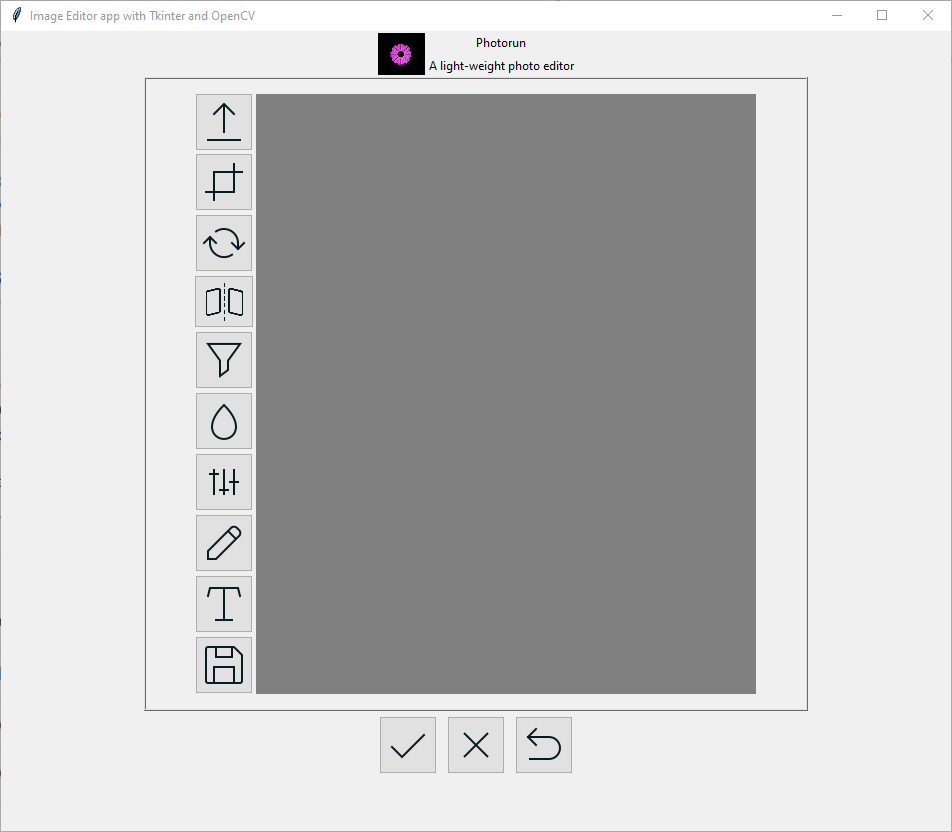
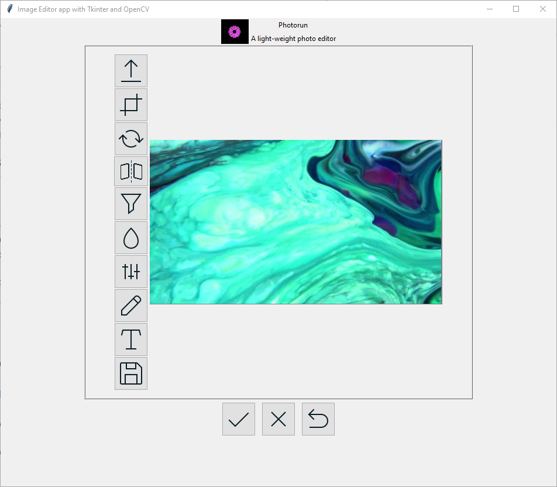
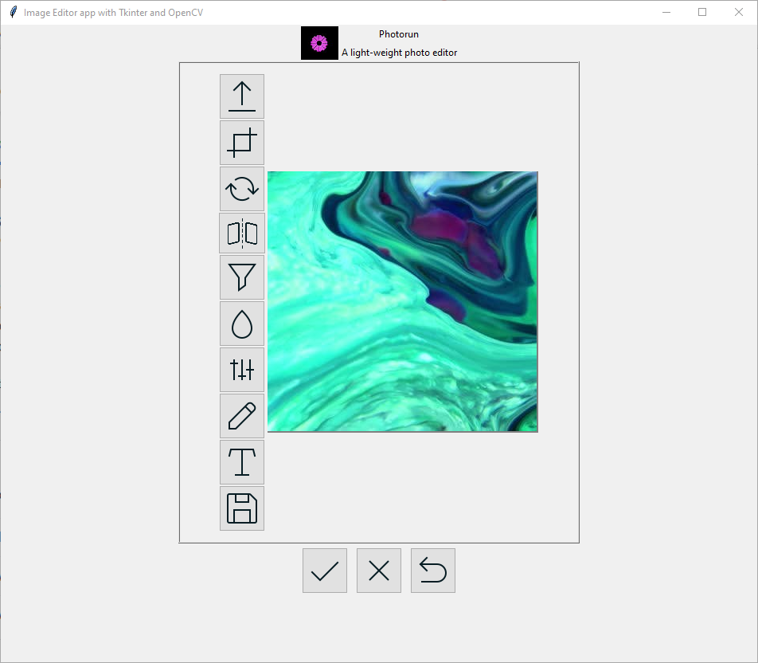
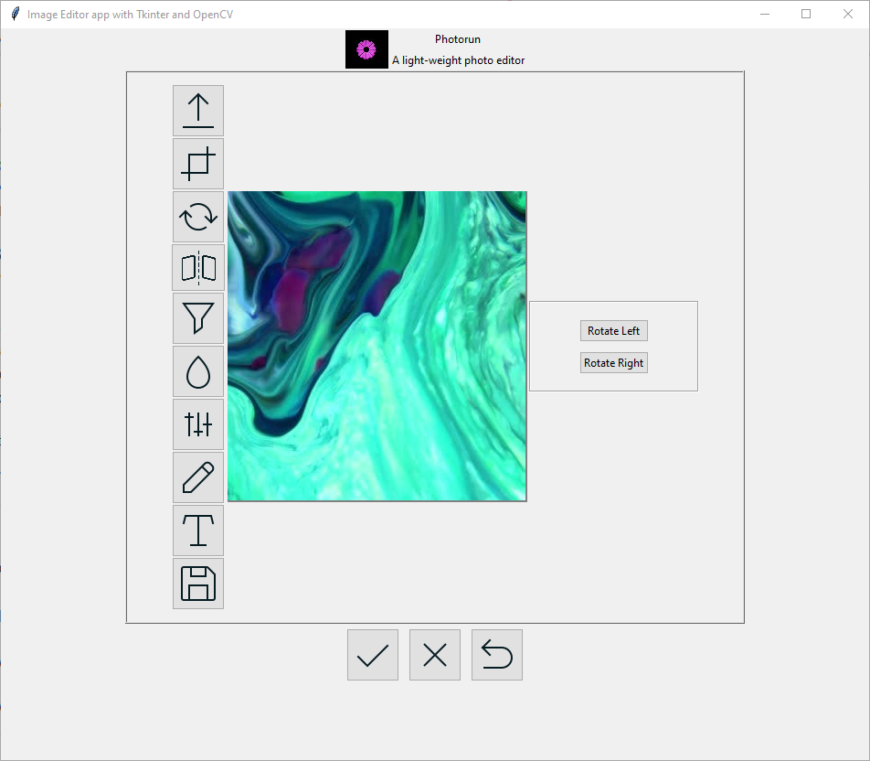
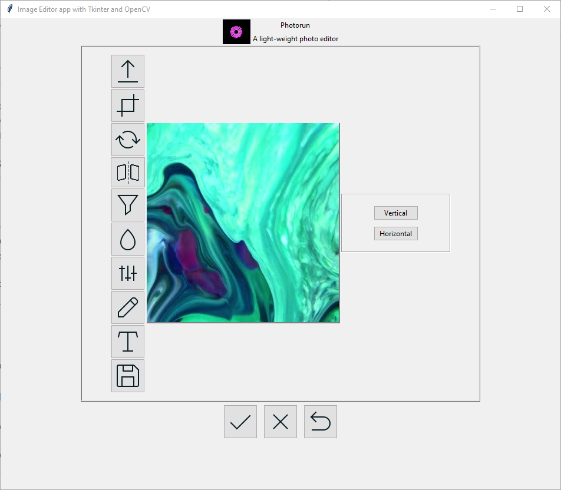
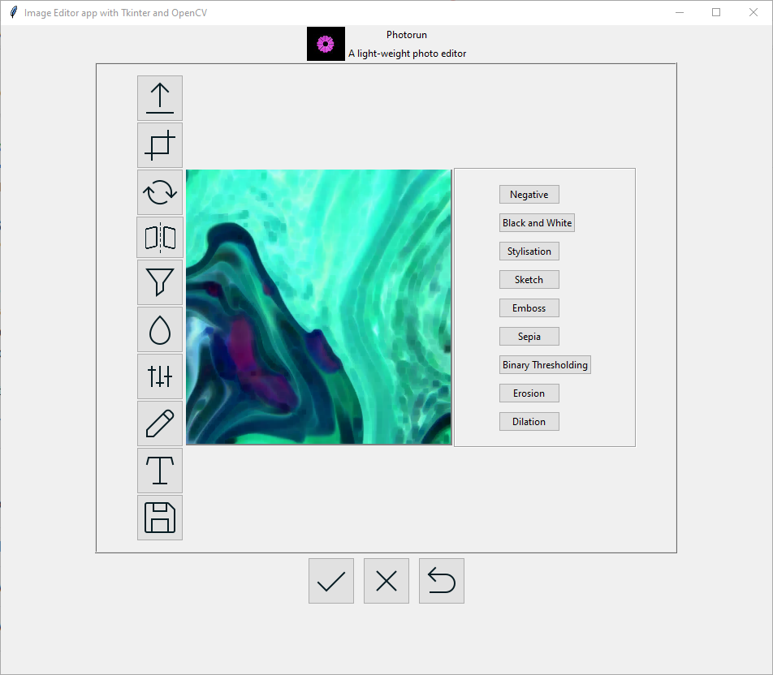
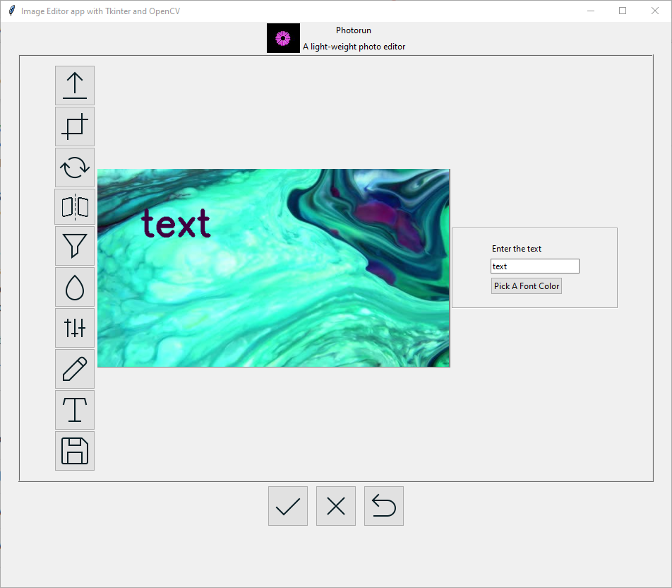
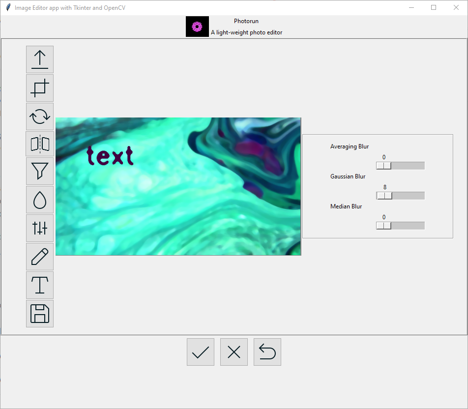

Photorun
========

Photorun is built to quickly make simple changes to images,
simply upload your image to the app and apply your changes.

Look how easy it is to use:

    python main.py

Features
--------

    - Uploading images

    - Cropping images

    - Rotating images

    - Flipping images

    - Applying common filters to images

    - Drawing text on images

    - Blurring or smoothening images

Installation
------------

All required libraries have been pushed into the repository.

Contribute
----------

- Issue Tracker: https://github.com/solasamuel/py-photorun/issues
- Source Code: https://github.com/solasamuel/py-photorun

Support
-------

If you are having issues, please let us know.
We have a mailing list located at: s.samuel3@yahoo.com

License
-------

The project is licensed under the BSD license.